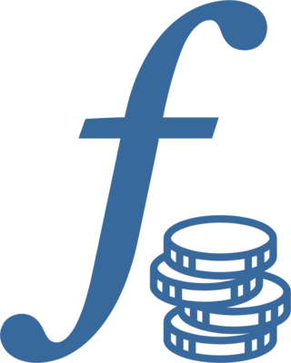

<h1 align="center">
    <br>
    folio
</h1>
<p align="center">A terminal-first tracker for the stock you hold and the stock that is still to vest.</p>
<p align="center">
    <a href="https://github.com/fgrosse/folio/releases"></a>
    <a href="https://github.com/fgrosse/folio/actions/workflows/ci.yml"></a>
    <a href="https://github.com/fgrosse/folio/blob/main/LICENSE"></a>
</p>

---

`folio` answers what the web site of the bank or broker behind your equity plan answers, without
logging in there:

- **Current**: what the shares you hold would sell for.
- **Potential**: what the shares that are still to vest, or vested and not released yet, are worth.
- **Total**: the two added up.

It is built for stock that comes from work as RSUs, on a vesting schedule, and also keeps what
those shares cost and what you sold them for. Everything is in a SQLite database on your machine,
and prices come from Yahoo Finance.

## Example

A tour of `folio` on a made-up account: selling shares of a lot, releasing a vest that is due, and
the views of the grants and the sales.


`folio demo` opens an account like this one for you to look around in.

## Usage

### Install

The quickest way is [mise](https://mise.jdx.dev/), which fetches the Go version folio is built with
and runs the build:

```bash
git clone https://github.com/fgrosse/folio
cd folio
mise run install    # fetch Go and the tools used to develop folio, build folio and install it
```

mise may ask you to trust the `mise.toml` of the checkout first (`mise trust`).

Inside the checkout, `folio` is on your `PATH` from then on. To have it everywhere, make that Go
your global one (`mise use -g go@1.27.0`), or copy the binary from `go env GOBIN` to a directory
that is on your `PATH`.

Without mise, any Go from 1.27 on does the same:

```bash
go install github.com/fgrosse/folio/cmd/folio@latest
```

Or build nothing at all: the [releases page][releases] has binaries for Linux, macOS and Windows.

### Look around with a demo account

```bash
folio demo
```

This opens folio on a made-up account: two grants, the shares released from them, a vest that is
waiting to be released, a sale, and some stock that was bought. `1`-`4` or `tab` switch between the
views, and `q` quits.

Nothing you do there touches a real account, and the demo account is gone again when you quit. It
is a different one every time; `folio demo --seed 7` makes the same one again. To keep a demo
account and come back to it, give it a path: `folio demo ~/folio-demo.db`.

### Enter your own account

A bare `folio` opens your own account, which is empty to begin with. The fastest way to fill it is
the command line, from what your plan's web site shows:

```bash
# A grant: 400 shares over four years, vesting every quarter, more with every year
folio grant "RSU 2025: 400 PANW quarterly 10/20/30/40 from 2026-02-20"

# A vest that has happened: of its 10 shares 6 arrived, worth $380.12 each that day
folio release 2026-02-20 6 @380.12

# Shares you bought yourself
folio lot 15 AAPL 2025-06-02 @201.50

# The rate your vests are taxed at, for an estimate of what they are worth after tax
folio config tax-rate 44.3%

folio status
```

Then open `folio` and carry on there. The sections below explain what each of these is.

Every command explains itself: `folio grant --help`, `folio release --help` and the others describe
the syntax they take, with examples, and list their options.

### How it works

An account is made of four things:

- A **grant** is an award of shares that vest over time, such as a grant of RSUs.
- A **vest** is one day on which shares of a grant vest. Vests are what the potential value counts,
  until each is **released** into a lot - with the number of shares that actually arrived, which
  is fewer than vested when some were sold or withheld for tax, and what a share was worth that
  day.
- A **lot** is shares that you hold: a number of shares of one stock, the day they arrived and
  what one of them cost that day. Lots are what the current value counts.
- A **sale** is shares of one lot that were sold on one day, at one price. The lot keeps what it
  was acquired with, and what is left of it is that less its sales. What the sales brought in is
  the money that was realized, which is stated apart from the three values.

### The TUI

A bare `folio` opens it. The header of every view has the three values, and the prices they were
worked out from. `1`-`4` or `tab` switch views, `q` quits.

| View | Shows | Keys |
|---|---|---|
| Holdings | Every lot that has shares left, and what they are worth | `a` add a lot, `e` edit, `s` sell shares of it, `d` delete |
| Vesting | Every vest that has not been released, in the order of their days, and what it is worth before and after tax | `r` release a vest that is due |
| Grants | Every grant, with the shares still to come | `a` add a grant, `d` delete |
| Sales | Every sale, with what it brought in and gained | `d` delete |

A lot, a grant and a release are typed as one line:

```
12.5 PANW 2026-03-15 @380.12                               a lot: shares, day and cost of a share
Payout: 10 PANW monthly x24 from 2026-01-15                a grant: 10 shares each month, 24 times
RSU 2025: 400 PANW quarterly 10/20/30/40 from 2026-02-20   a grant: 400 shares over four years
6 @380.12                                                  a release: shares that arrived, and their cost
```

In a lot, the day defaults to today and the cost may be left out.

In a grant, the interval is `monthly`, `quarterly` or `yearly`, and the day after `from` is that
of the first vest. With percentages, the shares are those of the whole grant, and each percentage
is the part of them that vests in one year, spread evenly over the vests of that year in whole
shares. A schedule that follows neither rule can be listed vest by vest, see `folio grant --help`.

Selling opens a form with a field each for the shares, the price, the day and notes of several
lines. `tab` moves between the fields, `enter` saves, and in the notes, where `enter` starts a new
line, `ctrl+s` does. The note of a sale shows above the Sales table while the sale is selected.

A vest is taxed as income when it vests, at a rate that depends on the rest of your income and where
you live. folio does not work it out: it takes the rate you set with `folio config tax-rate` for
every vest, and the Vesting view shows what is left of each after tax at that rate. The three values
stay the bank's, before tax.

Prices are fetched when the TUI starts and every five minutes after that. It opens with the last
prices it saw, so it works without a network too.

### The command line

```bash
folio                                              # open the TUI
folio demo                                         # open the TUI on a made-up account
folio lot 12.5 PANW 2026-03-15 @380.12
folio grant "Payout: 10 PANW monthly x24 from 2026-01-15"
folio grant --vests schedule.txt "Payout: PANW"    # the vests listed, "<YYYY-MM-DD> <shares>" a line
folio release 2026-01-15 6 @380.12                 # 6 shares arrived, worth $380.12 each that day
folio config tax-rate 44.3%                        # the rate vests are taxed at
folio config tax-rate                              # print it, or exit 1 if it is not set
folio config                                       # the whole configuration, as YAML
folio config -o json                               # the whole configuration, as JSON
folio status
folio status --json
folio version                                      # which release this is
```

Every verb has a `--help` that says more.

`folio status` prints the three values, and what was realized once something was sold. With
`--json` it prints an object for a status bar widget:

```json
{"current":"3368.13","potential":"7925.00","total":"11293.13","realized":"0.00","realized_gain":"0.00","currency":"USD","unpriced":[]}
```

### Where your data is

The database of your account is `$XDG_DATA_HOME/folio/folio.db`, which is
`~/.local/share/folio/folio.db` unless you set it otherwise. `--db` or the `FOLIO_DB` environment
variable name another one. It is a single SQLite file: copy it to back it up.

Nothing leaves your machine except the symbols of your stock, which are sent to Yahoo Finance to
ask for their prices.

## Limitations

- Quotes come from Yahoo Finance's chart endpoint, which needs no API key but is not an official
  API: it may change or turn requests away without notice, and prices can be delayed.
- Everything is in USD for now.
- A grant and a sale cannot be edited yet, only deleted and entered again.
- folio keeps records and adds them up; it is no tax or investment advice.

## Built With

* [Bubble Tea](https://github.com/charmbracelet/bubbletea), [Bubbles](https://github.com/charmbracelet/bubbles) and [Lip Gloss](https://github.com/charmbracelet/lipgloss) - The TUI framework, its components and its styling
* [modernc.org/sqlite](https://gitlab.com/cznic/sqlite) - SQLite without cgo
* [cobra](https://github.com/spf13/cobra) - The commands of the command line
* [decimal](https://github.com/shopspring/decimal) - Shares and prices that add up exactly
* [testify](https://github.com/stretchr/testify) - A simple unit test library
* _[and more][built-with]_

## Development

```bash
mise run install      # build and install folio, fetching Go, gopls, golangci-lint, vhs and goreleaser
mise run test
mise run lint
mise run git:hooks    # run the tests and the linter before every push
vhs demo.tape         # record the demo of this file again, which needs ffmpeg
```

See `CLAUDE.md` for how the project is built and why it is the way it is, and `TODO.md` for what is
planned.

## Contributing

Please read [CONTRIBUTING.md](CONTRIBUTING.md) for details on our code of
conduct and on the process for submitting pull requests to this repository.

## Versioning

We use [SemVer](http://semver.org/) for versioning.
All significant (e.g. breaking) changes are documented in the [CHANGELOG.md](CHANGELOG.md).
A list of all available versions can be found at the [releases page][releases], and
[RELEASING.md](RELEASING.md) describes how a release is cut.

## Authors

- **Friedrich Große** - *Initial work* - [fgrosse](https://github.com/fgrosse)
- See also the list of [contributors][contributors] who participated in this project.

## License

This project is licensed under the BSD-3-Clause License - see the [LICENSE](LICENSE) file for details.

[releases]: https://github.com/fgrosse/folio/releases
[contributors]: https://github.com/fgrosse/folio/contributors
[built-with]: go.mod
